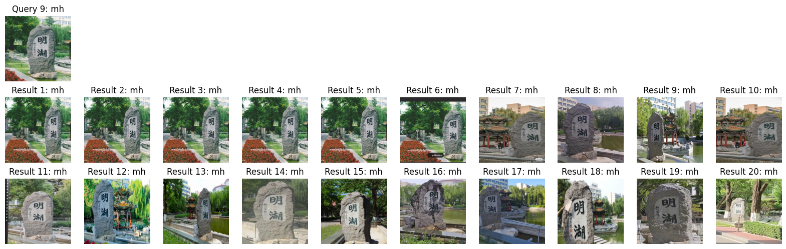

# Image Retrieval

北京交通大学2024春季 邬俊老师课程《计算机视觉基础》

交大视觉印象数据集2024

## 1. Prepare training dataset

Put the data under `${DATA_ROOT}`. The prepared directory would look like:

```bash
${DATA_ROOT}
├── base
│   ├── fh
│   ├── mh
│   ...
│   ├── zx
│   ├── util_pic
├── query
│   ├── fh
│   ├── mh
│   ...
│   ├── zx
```

`${DATA_ROOT}` is set to `./data` by default, which can be modified via hydra command line interface `--data '/your/data/path'`.

Run `split.py` first to split the images in `util_pic` by label (totally 17 classes). Then delete `util_pic`.

Now we have a training dataset (is set to `./data/base` by default) containing **6445** images of **25** categories.

## 2. Fine-tuning

- **Prepare the environment**

```shell
conda activate your_enviroment
cd /your/path/to/your_project
```

- **AlexNet w/o latent layer**

```shell
python finetune.py --model alexnet --batchsize 64 --lr 0.001 --num_epochs 300 --data './your/data/path' --seed 42
```

- **AlexNet w/ latent layer**

```shell
python finetune.py --model alexnet --batchsize 64 --lr 0.001 --num_epochs 300 --data './your/data/path' --seed 42 --latent_layer --latent_size 48
```

- **ResNet-50 w/o latent layer**

```shell
python finetune.py --model resnet --batchsize 64 --lr 0.001 --num_epochs 300 --data './your/data/path' --seed 42
```

- **Memory Usage**

  Running on NVIDIA GeForce RTX 3090.

  

## 3. Retrieval

Adding `--plot` to the command line will export the retrieved images for each image in the query set. You can find them in `./plots/your_model_name/[20/40/60]`.

- **AlexNet w/o latent layer**

```shell
python retrieval.py --model alexnet --data './your/data/path' [--plot]
```

- **AlexNet w/ latent layer**

```

```

- **ResNet-50 w/o latent layer**

```shell
python retrieval.py --model resnet --data './your/data/path' [--plot]
```

## Example of results

- **AlexNet w/o latent layer**

  `08.png` in `./plots/your_model_name/20`.

  

  `P@K.png` in `./plots/your_model_name`.

  

- **ResNet-50 w/o latent layer**

  `16.png` in `./plots/your_model_name/60`.

  

  `P@K.png` in `./plots/your_model_name`.

  
